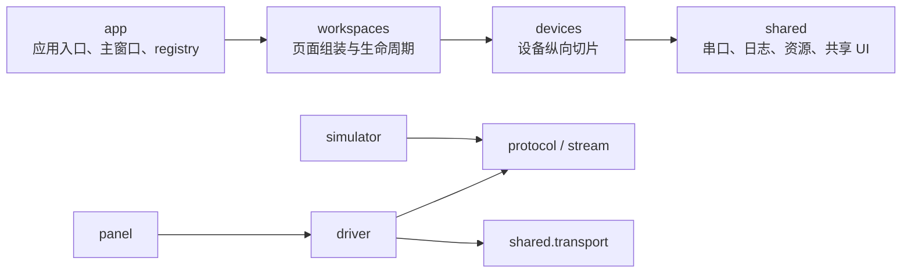

# SoftHertz Tool

SoftHertz Tool 是面向 SoftHertz 设备的跨平台串口调试上位机。项目使用 Python、PySide6 和 pyserial，采用“设备纵向切片 + 共享组件 + 工作区组装”的结构，便于继续增加设备协议、调试接口和界面。

当前提供两个工作区：

- `AFDTR`：组合 KaUDC004A、AFDT1024（1024 发射阵列）和 AFDR1024（1024 接收阵列）。
- `AFD01_QS`：配置 AFD01_QS，接收实时状态，并配置、显示 KA256 TX/RX 阵列规模。

## 名称约定

| 场景 | 名称 |
| --- | --- |
| UI 产品名 | `SoftHertz Tool` |
| Windows 可执行文件 | `SoftHertz_Tool.exe` |
| Python distribution / CLI | `soft-hertz-tool` |
| Python import 包 | `soft_hertz_tool` |
| Qt 配置应用名 | `SoftHertz_Tool` |
| 默认日志目录 | `Documents/SoftHertz/SoftHertz_Tool/logs` |

`AFDTR` 是工作区名称，不是设备型号。发射阵列和接收阵列在 UI、日志及文档中必须分别写作：

- `AFDT1024`：1024 发射阵列；
- `AFDR1024`：1024 接收阵列。

源码中的 `devices/afdtr1024` 和 `AFDTR1024*` 是两种阵列共用实现的内部名称，不应作为对外硬件型号。

## 当前功能

### AFDTR 工作区

三个面板分别维护串口连接、驱动线程和设备状态，互不共用串口会话。

| 设备 | 功能 |
| --- | --- |
| KaUDC004A | 设备复位；版本、温度、本振和衰减查询；TX/RX 本振设置；TX/RX 衰减设置 |
| AFDT1024 | 波束设置；阵列使能；推动 PA 使能；极化设置；状态与波束参数查询 |
| AFDR1024 | 波束设置；阵列使能；极化设置；状态与波束参数查询 |

AFDT1024/AFDR1024 支持一条总线连接多个子阵：

- `ID=0x00`：广播配置，不等待设备回复；
- `ID=实际 ID`：总线设备均接收，由目标 ID 回复；
- `ID=实际 ID + 0x80`：仅目标子阵接收并回复；
- 可手工填写 ID 列表，也可按 1/2 列布局生成子阵 ID；
- 查询 1 与查询 2 的结果按 ID 合并显示；
- 波束计算使用量化到 50 MHz 步进后的设备实际频率。

### AFD01_QS 工作区

- 支持 QS V1.6 指令 `0x01`～`0x0B` 的构造、发送及相关回读；
- 解析 `0xA0` 实时状态，串口链路可接收约 100 Hz 数据，业务 UI 最多按 10 Hz 刷新；
- 使用滑动窗口显示 A0 上报频率，超过 1 秒未收到 A0 时显示超时；
- 通过 `0x0B/0xA1` 查询和设置 TX/RX 阵列规模；
- 支持 `8×8`、`7×7`、`6×6`、`5×5`、`4×4` 阵列；
- TX/RX 网格区分启用、缓存、待确认、失败和关闭状态；
- 阵列请求同一时刻只允许一个，3 秒超时且不自动重发；
- 不支持阵列命令的固件只降级阵列功能，不影响其他 QS 指令。

### 工作区切换与报文监视

- 首次启动默认进入 `AFDTR`，之后记忆最近选择的工作区；
- 切换前停用隐藏工作区、断开其串口并暂停页面定时器；
- 串口线程未能安全停止时取消切换或退出；
- 全局报文监视器统一显示 `TX`、`RX` 和 `DROP` 事件；
- 支持按设备、方向和文本筛选，支持暂停、复制、清空和另存；
- UI 每 100 ms 批量刷新，最多保留 10000 行；
- 独立日志线程自动落盘，单文件达到 50 MiB 后创建新文件，不自动删除历史日志。

## 当前不支持范围

以下能力不属于当前版本：

- DEBUG 通用设备页面；
- TCP 客户端或服务端通信；
- UDP 单播、组播或广播通信；
- 通用多通道实时曲线页面；
- KaUDC004A 设备模拟器。

如需重新引入这些能力，应按当前 `devices`、`shared/transport` 和测试边界重新设计，不应绕过现有分层。

## 软件框架与技术路线

| 层面 | 选型或策略 |
| --- | --- |
| 语言 | Python 3.9+，类型注解 |
| GUI | PySide6 Widgets；Windows 使用 Fusion 样式，macOS 使用原生样式 |
| 串口 | pyserial；每个 Driver 独占一个后台串口线程 |
| 协议 | 纯函数编解码 + 可恢复的流式拆帧器 |
| 设备组织 | 每个设备维护 protocol、stream、driver、panel，并按需提供 models、widgets、simulator |
| 页面组织 | Workspace 组合设备 Panel，主窗口通过静态 registry 创建 Workspace |
| 可观测性 | `FrameRecord` 统一 TX/RX/DROP，UI 批量刷新，日志线程异步落盘 |
| 测试 | pytest；设备、共享组件和集成测试分层 |
| 打包 | PyInstaller 单文件 Windows GUI 程序 |
| 持续集成 | GitHub Actions 执行测试、构建 Artifact，并在 tag 构建时附加 Release 资产 |

依赖方向固定为：



关键原则：

- `shared` 不导入具体设备、工作区或应用模块；
- `devices` 不导入 `workspaces` 或 `app`；
- Panel 只采集输入和展示状态，通过 Driver 的语义接口操作设备；
- Driver 管理串口会话和协议事件分发，不创建业务 UI；
- protocol/stream 不依赖 Qt 控件或串口对象；
- 模拟器复用正式协议实现，不维护第二份协议常量和校验算法；
- `MainWindow` 不硬编码具体设备实例，只读取静态 workspace registry；
- 高频原始流、统计、UI 刷新和日志写入分层处理。

详细说明见：

- [架构概览](docs/architecture/overview.md)
- [开发规范](docs/development/standards.md)
- [新增设备指南](docs/development/adding-device.md)
- [测试与验收边界](docs/development/acceptance-boundaries.md)

## 目录结构

```text
.
├── .github/
│   └── workflows/                  # Windows CI、Artifact 与 Release
├── docs/
│   ├── architecture/
│   │   └── overview.md             # 当前架构与依赖边界
│   ├── development/
│   │   ├── standards.md            # 编码、协议、线程和测试规范
│   │   ├── adding-device.md        # 新增设备/工作区步骤
│   │   └── acceptance-boundaries.md
│   ├── protocols/
│   │   ├── controlled-originals/   # 受控协议原件
│   │   └── readable-notes/         # 便于检索的协议说明
│   └── project-restructure/        # 工程结构变更的受控计划与验收
├── packaging/
│   ├── entrypoint.py               # PyInstaller 稳定入口
│   └── build_windows.py            # Windows 构建脚本
├── src/
│   └── soft_hertz_tool/
│       ├── __main__.py             # python -m soft_hertz_tool
│       ├── app/                    # 应用、主窗口、registry
│       ├── devices/
│       │   ├── kaudc004a/
│       │   ├── afdtr1024/          # AFDT1024/AFDR1024 共用实现
│       │   └── afd01_qs/
│       ├── resources/              # PNG/ICO
│       ├── shared/
│       │   ├── transport/
│       │   ├── observability/
│       │   └── ui/
│       └── workspaces/
├── tests/
│   ├── devices/
│   ├── shared/
│   └── integration/
├── pyproject.toml
├── run.sh
└── run.bat
```

正式业务实现只能放在 `src/soft_hertz_tool`。`build/`、`dist/`、虚拟环境、日志、缓存、生成的 `.spec` 和可执行文件不得提交。

## 环境要求

- Python 3.9+
- PySide6 `>=6.5,<6.10`；Windows 发布基线固定为 6.9.3
- pyserial 3.5+
- pytest `>=7,<10`（开发/测试）
- PyInstaller `>=6.20,<6.21`；Windows 发布基线固定为 6.20.0
- Windows 或 macOS；Linux 可源码运行，但需要自行确认 Qt 依赖和串口权限

串口通常使用 8 数据位、无校验、1 停止位、无流控。波特率必须以对应设备协议和固件配置为准。

## 快速开始

### macOS / Linux

在仓库根目录执行：

```bash
./run.sh
```

脚本会创建或复用根目录 `.venv`，安装当前项目并启动 GUI。依赖变更后可执行：

```bash
./run.sh --update
```

### Windows

在仓库根目录执行：

```bat
run.bat
```

强制更新依赖：

```bat
run.bat --update
```

### 手动安装与启动

macOS / Linux：

```bash
python3 -m venv .venv
source .venv/bin/activate
python -m pip install --upgrade pip
python -m pip install -e ".[dev]"
python -m soft_hertz_tool
```

Windows：

```bat
python -m venv .venv
.venv\Scripts\activate
python -m pip install --upgrade pip
python -m pip install -e ".[dev]"
python -m soft_hertz_tool
```

安装完成后也可以使用：

```bash
soft-hertz-tool
```

## 无硬件联调

模拟器与上位机必须连接一对虚拟串口的不同端点。同一端口不能同时被两个进程打开。

### AFDT1024 / AFDR1024

```bash
soft-hertz-afdtr-sim <TX模拟器端口> <RX模拟器端口> \
  --ids 1,2,3 \
  --baudrate 460800
```

模拟器支持配置回显、查询 1、查询 2 和多子阵状态。上位机的 AFDT1024、AFDR1024 面板分别连接两组虚拟串口的另一端。

### AFD01_QS

```bash
soft-hertz-qs-sim <QS模拟器端口> --baudrate 921600
```

模拟器持续输出约 100 Hz 的 `0xA0`，并响应 `0x0B` 阵列查询/设置，返回 `0xA1`。

模拟器验证的是主机侧协议和数据流，不代表真实设备验收完成。

## 测试

安装开发依赖后，在仓库根目录执行：

```bash
QT_QPA_PLATFORM=offscreen python -m pytest -q
python -m compileall -q src tests packaging
```

Windows PowerShell 可先设置：

```powershell
$env:QT_QPA_PLATFORM = "offscreen"
python -m pytest -q
```

测试目录职责：

| 目录 | 覆盖范围 |
| --- | --- |
| `tests/devices` | 协议向量、边界值、流式拆帧、Driver、Panel、模拟器和设备业务回归 |
| `tests/shared` | 串口线程停止/写入、报文监视、异步日志与轮转 |
| `tests/integration` | workspace registry、切换/退出、配置命名空间、依赖方向和仓库结构 |

每次修改至少执行与风险相匹配的验证：

1. 协议正常向量、上下限、非法长度、坏校验、分包、粘包和异常字节恢复；
2. UI 状态、请求超时、工作区切换、串口释放和快速重连；
3. 模拟器设置/回读闭环；
4. 目标操作系统源码启动或打包产物冒烟；
5. 涉及协议、时序或性能时的真实设备验收。

## Windows 打包与发布

PyInstaller 不支持跨操作系统生成目标产物。构建 Windows EXE 时应在 Windows 环境执行：

```bat
python -m pip install -e ".[dev]"
python packaging\build_windows.py
```

输出：

```text
dist/SoftHertz_Tool.exe
```

临时文件位于 `build/pyinstaller/`，不应提交。

`.github/workflows/build-windows.yml` 支持手动触发和 `v*` tag 触发。工作流应依次完成：

1. 在 Python 3.9 和 3.11.9 环境从仓库根安装 `.[dev]`；
2. 两个 Python 版本分别执行正式 pytest 套件；
3. 测试全部通过后，在固定的 Python 3.11.9 发布环境调用 `packaging/build_windows.py`；
4. 在 Windows runner 上执行打包产物 `--smoke`；
5. 生成 `SoftHertz_Tool.exe.sha256`；
6. 上传 `SoftHertz_Tool-windows` Artifact；
7. tag 构建时将 EXE 和 SHA256 文件附加到 GitHub Release。

最低版本测试使用 `packaging/constraints-test-py39.txt`，发布构建使用
`packaging/constraints-windows-py311.txt`。依赖升级必须同步更新约束文件并重新完成 Windows 原生冒烟。

CI 构建成功只说明 runner 上完成测试和打包。发布完成还必须确认 Release 资产可下载，并在干净目标 Windows 环境完成启动、资源加载、日志路径和串口冒烟。

## 新增设备

新增设备前先阅读 [新增设备指南](docs/development/adding-device.md)。标准流程为：

1. 建立范围、非目标和验收标准；
2. 在 `src/soft_hertz_tool/devices/<device>/` 建立纵向切片；
3. 先实现纯协议和流式拆帧，再实现 Driver 与 Panel；
4. 复用 `shared.transport`、`FrameRecord` 和共享连接控件；
5. 按需增加模拟器，并复用正式协议模块；
6. 在现有 Workspace 组装设备，或新建 Workspace 后加入静态 registry；
7. 同步增加 `tests/devices`、`tests/shared` 或 `tests/integration` 覆盖；
8. 更新 README、协议索引、TODO 和验收边界。

不要把新设备判断堆入 `MainWindow`，不要在 Panel 中手工拼帧，也不要复制串口线程或日志实现。

## 开发规范摘要

- 非简单功能开始前建立 plan、acceptance 和持续维护的 development 文档；
- 受控协议原件是字段、端序、校验和物理量定义的最高依据；
- 协议变更必须同时更新 protocol、stream、simulator、tests 和文档；
- Qt 控件只能在主线程更新，阻塞串口操作和 `sleep` 不得进入 UI 线程；
- pyserial 对象只能由所属串口线程打开、读写和关闭；
- Worker 停止必须有超时、可重复调用，并由调用方确认真正退出；
- 原始帧和丢弃事件统一转换为 `FrameRecord`；
- Python 使用 4 空格、类型注解，PySide6 槽函数使用 `@Slot`；
- 修复缺陷时先增加可复现测试；
- 不提交凭据、用户数据、日志、缓存、虚拟环境或构建产物；
- Git 提交使用 `type(scope): 中文描述`，除非仓库另有约定。

完整规则见 [开发规范](docs/development/standards.md)。

## 验收边界

以下证据必须分开记录，不能互相替代：

1. 源码静态检查；
2. 主机单元/集成测试；
3. 模拟器闭环；
4. macOS/Linux 源码运行或本地打包；
5. Windows 原生 EXE 启动；
6. 真实设备配置、查询和长稳运行。

例如，pytest 和模拟器通过不能证明 Windows 客户机可以加载 Qt DLL，也不能证明真实设备的串口时序、字段含义和持续上报稳定。详细门槛见 [测试与验收边界](docs/development/acceptance-boundaries.md)。

## TODO

| 优先级 | 事项 | 完成标准 |
| --- | --- | --- |
| P0 | Windows EXE 原生验收 | 触发更新后的 CI 构建；下载 EXE，在干净 Windows 10 1809+ 或 Windows 11 启动，验证图标、Qt 资源、日志目录和串口打开 |
| P0 | 真实设备回归 | KaUDC004A、AFDT1024、AFDR1024、AFD01_QS 分别完成配置/查询闭环并保存版本、串口参数、日志和结果 |
| P0 | AFD01_QS 100 Hz 长稳 | 真实设备持续运行，记录丢帧率、超时恢复、CPU/内存、UI 响应和日志轮转 |
| P1 | 补齐 QS V1.6 受控协议 | 将允许入库的受控原件加入 `docs/protocols/controlled-originals`，逐字段核对当前实现 |
| P1 | 确认 KaUDC004A 温度换算 | 用受控协议和真实设备确认温度原始值的偏移/符号规则，补充协议向量 |
| P1 | 增加 KaUDC004A 模拟器 | 复用正式 protocol/stream，实现主要命令的设置与查询闭环 |
| P1 | 固化 Windows 启动冒烟 | 在 CI 或专用 Windows 环境运行构建产物，捕获 Qt DLL/VC 运行库/资源加载失败 |
| P2 | 统一版本来源 | 让 tag、Python 包版本、EXE 文件版本和 Release 版本由单一来源生成并校验 |
| P2 | 定义日志保留策略 | 在 50 MiB 单文件轮转基础上，定义总容量、保留时间、归档和清理方式 |
| P2 | 扩展模拟器操作说明 | 补充各平台虚拟串口创建、端口配对及故障排查说明 |

完成 TODO 时，应同步更新自动化测试和验收文档；没有对应平台或硬件证据的项目不能标记为完成。

## 常见问题

### 串口列表没有目标端口

确认系统已枚举设备、驱动已安装、当前用户具有串口权限，并检查端口是否被其他工具或模拟器占用。

### AFDT1024/AFDR1024 广播后没有回复

`ID=0x00` 是不回复的广播配置。需要回读时请选择具体 ID；需要只让目标子阵接收时使用 `ID+0x80`。

### AFD01_QS 阵列区显示不支持或通信超时

`0x0B` 请求在 3 秒内未收到 `0xA1` 时会进入降级状态。可能原因包括固件不支持、串口参数错误或链路丢包；其他 QS 功能仍可继续使用。

### 日志持续占用磁盘

当前日志只轮转、不自动删除。默认目录为系统“文档”目录下的 `SoftHertz/SoftHertz_Tool/logs`，长期运行时需要定期归档或清理。

## 接手顺序

1. 按“快速开始”启动应用并执行完整 pytest；
2. 依次阅读 `app`、`workspaces`、`devices`、`shared`；
3. 使用虚拟串口跑通两个模拟器和设置/回读闭环；
4. 阅读受控协议原件与对应 `protocol.py`；
5. 从 TODO 的 P0 项开始补齐 Windows 与真实设备证据；
6. 新功能遵循 plan、acceptance、development 和完成后复核流程。
