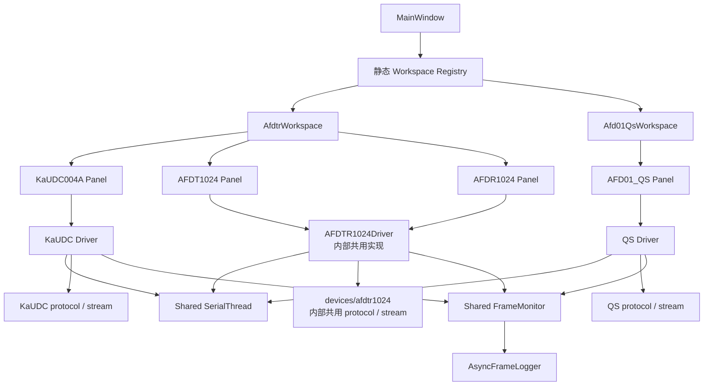

# SoftHertz AFDTR Tool

面向 Ka 波段设备的跨平台串口调试上位机。程序使用 PySide6 构建图形界面，当前支持两套相互独立的设备后端：

- **AFDTR**：同时调试 KaUDC004A 上下变频器、AFDT1024（1024 发射阵列）和 AFDR1024（1024 接收阵列）。
- **AFD01_QS**：按 QS V1.6 协议配置 AFD01，接收实时状态，配置并可视化 KA256 TX/RX 阵列规模。

源码运行和发布产物统一使用名称 **SoftHertz_AFDTR_Tool**。本 README 描述当前 PySide6 代码线；仓库历史分支中存在另一套 PyQt5 架构，不应直接混用其控制器、协议偏移或文档结论。

`AFDTR` 是工作区和产品包名，不是硬件型号。`devices/afdtr1024` 目录及 `AFDTR1024*` 类名仅表示 AFDT1024/AFDR1024 的内部共用实现，也不是硬件型号；面向用户的界面、日志和文档应分别使用 AFDT1024、AFDR1024。

## 项目状态

| 项目 | 当前状态 |
| --- | --- |
| AFDT1024 / AFDR1024 协议 | V2.2，共用协议实现，支持多子阵 ID、状态查询 1/2 合并显示 |
| AFD01_QS 协议 | QS V1.6，支持 0x01～0x0B 下发、0xA0/0xA1 接收 |
| 自动化测试 | 新包结构 108 项通过；原脚本入口 75 项兼容回归继续通过 |
| 本地打包 | macOS 已完成 PyInstaller 依赖分析、打包和主界面启动验证 |
| Windows 发布 | 已有 tag 触发的 GitHub Actions；双型号版本仍需完成 Windows EXE 实际构建与启动验收 |
| 硬件验收 | 模拟器链路已验证；真实 AFDT1024、AFDR1024、AFD01_QS 设备联调仍是交付门槛 |

> 自动化测试和模拟器通过不等于硬件验收通过。协议升级、串口时序、持续 100 Hz 上报和阵列回读均应在目标设备上重新验证。

## 主要功能

### AFDTR（三设备）

三个设备面板并排显示，各自拥有独立串口、Worker 线程和状态，不共享连接：

| 面板 | 功能 |
| --- | --- |
| KaUDC004A | 设备复位，版本/温度查询，TX/RX 本振设置与查询，TX/RX 衰减设置与查询 |
| AFDT1024（1024 发射阵列） | 波束设置，阵列使能，推动 PA 使能，极化设置，状态与波束参数查询 |
| AFDR1024（1024 接收阵列） | 波束设置，阵列使能，极化设置，状态与波束参数查询 |

TX/RX 支持一条总线挂接多个子阵：

- `ID=0x00`：广播，设备不返回。
- `ID=实际 ID`：总线设备均接收，目标 ID 返回。
- `ID=实际 ID + 0x80`：仅目标子阵接收并返回。
- 可手动填写 ID 列表，也可按 1/2 列阵列布局生成 ID。
- 查询 1 的电压、温度、PA 状态与查询 2 的极化、使能、频率、BeamV、BeamH 合并到同一 ID 行。
- 波束计算使用量化到 50 MHz 步进后的设备实际频率，避免设置值与回读值产生档位偏差。

### AFD01_QS

- QS V1.6 指令 0x01～0x0A：SNR/指示/功耗/重启、波束配置、发射开关、航向扫描角、跟踪模式、航向对齐角、TX/RX/共同波束角和 TLE。
- 解析 0xA0 实时状态；串口可按 100 Hz 接收，业务表格最多按 10 Hz 刷新。
- 使用约 2 秒滑动窗口显示 A0 上报频率；超过 1 秒没有 A0 时显示超时。
- 通过 0x0B/0xA1 查询和配置 TX/RX 阵列规模，支持 `8×8`、`7×7`、`6×6`、`5×5`、`4×4`。
- TX/RX 8×8 网格区分启用、缓存、待确认、失败和关闭状态。
- 阵列请求同一时刻只允许一个，3 秒超时，不自动重发；旧固件不支持时只降级阵列功能，不影响其他 QS 指令。

### 型号切换与报文监视

- 首次启动默认进入 AFDTR，之后使用 `QSettings` 记忆最近选择的型号。
- 切换型号前会断开隐藏页面的全部串口并暂停页面定时器；线程未能安全停止时取消切换。
- 全局报文监视器统一记录 KaUDC004A、AFDT1024、AFDR1024 和 AFD01_QS 的 `TX`、`RX`、`DROP` 事件。
- 型号筛选项按设备事件动态发现；支持按实际设备型号、方向和文本筛选，暂停显示，复制所选/全部内容及另存为文件。
- UI 每 100 ms 批量刷新，最多保留 10000 行，避免高频报文持续冲击主线程。
- 报文由独立日志线程自动保存到系统“文档”目录下的 `SoftHertz/AFDTR_Tool/logs`；单文件达到 50 MiB 后轮转，当前不会自动删除历史文件。

## 软件架构



### 技术路线

- **组织方式**：正式代码位于 `src/soft_hertz_tool`，采用“设备纵向切片 + 共享基础设施 + 工作区组装”。
- **界面层**：PySide6 Widgets。macOS 保持原生样式，Windows 使用 Fusion 样式。
- **串口层**：共享 `SerialThread` 独占 pyserial 对象，UI 通过有界发送队列提交字节；读写均有超时，停止路径会取消阻塞 I/O 并确认线程真正退出。
- **协议层**：协议编解码保持为无 UI 依赖的纯函数；流式解析器负责分包、粘包、坏长度、坏校验和异常字节恢复。
- **设备层**：每个设备目录独立维护 protocol、stream、driver、panel、simulator 和测试；Panel 不手工拼帧。
- **工作区层**：AFDTR 工作区组合三个设备页面；QS 工作区组合一个 QS 页面。主窗口仅通过静态 registry 加载并统一管理生命周期。
- **高频数据**：接收、统计、业务 UI 和日志落盘分层限频；100 Hz 原始流不直接驱动 100 Hz 控件重绘。
- **状态管理**：页面状态局部化；型号偏好用 `QSettings` 保存；连接代际隔离旧会话的延迟信号，切换型号时释放串口并暂停隐藏页面定时器。
- **可测试性**：AFDT1024/AFDR1024 共用模拟器，QS 提供独立模拟器（KaUDC004A 暂无），协议、UI 生命周期、日志轮转和持续流均有 pytest 回归。
- **发布**：PyInstaller 从正式包入口生成单文件应用；Windows workflow 先执行正式包与兼容入口回归，再构建并发布 EXE。

## 协议概览

| 设备 | 帧格式 | 校验 | 默认/规范波特率 | 权威依据 |
| --- | --- | --- | --- | --- |
| KaUDC004A | `AA 55 0C 00 + 6 Byte Payload + CRC`，固定 12 字节 | CRC16-CCITT，big-endian | 以设备配置为准 | `DOC/KaUDC004A控制命令20250513-UG.pdf` |
| AFDT1024 / AFDR1024 | `PSA + ID + LEN + DATA + CHECKSUM` | 除校验字节外求和取低 8 位 | 460800 | `DOC/*_Protocol.md` 及 AFDT1024/AFDR1024 V2.2 PDF |
| AFD01_QS | `0x55 + CMD + LEN_BE + PAYLOAD + CHECKSUM_BE` | `CMD/LEN/PAYLOAD` 求和取低 16 位 | 921600 | `src/soft_hertz_tool/devices/afd01_qs/protocol.py` 当前实现；受控 QS V1.6 原始协议文档待补入仓库 |

修改协议时必须先确认协议版本、字段长度、端序、校验范围和返回指令号。不得根据旧代码或抓包片段猜测协议含义。

## 目录结构

```text
.
├── README.md
├── run.sh / run.bat                    # 一键创建环境并启动
├── .github/workflows/build-windows.yml # Windows 打包与 Release
├── DOC/                                # 受控设备协议及 PDF 原件
└── KauDC004A_TestTool/
    ├── pyproject.toml                   # 正式包、依赖与命令行入口
    ├── requirements.txt
    ├── src/soft_hertz_tool/
    │   ├── __main__.py                 # python -m soft_hertz_tool
    │   ├── app/                        # 主窗口、静态 registry、应用样式
    │   ├── shared/                     # 串口、日志、资源和共享控件
    │   ├── devices/
    │   │   ├── kaudc004a/              # protocol/stream/driver/panel
    │   │   ├── afdtr1024/              # AFDT1024/AFDR1024 内部共用实现及模拟器
    │   │   └── afd01_qs/               # QS 设备、阵列控件及模拟器
    │   ├── workspaces/                 # AFDTR、AFD01_QS 页面组装
    │   └── resources/
    ├── tests/
    │   ├── devices/
    │   ├── shared/
    │   └── integration/
    ├── packaging/entrypoint.py         # PyInstaller 稳定入口
    ├── code/
    │   ├── main_qt6.py                 # 旧启动命令兼容层
    │   ├── *_protocol.py / *_panel.py  # 旧导入路径兼容层
    │   └── build_spec.py               # 本地 PyInstaller 构建脚本
    └── docs/
        ├── architecture-refactor/      # 本次架构计划、验收和开发记录
        └── device-model-integration/   # 双型号改造记录
```

`DEV_LOG.md`、`plan.md`、`UI_FREEZE_ANALYSIS.md` 和各历史迁移计划用于追溯设计背景，其中部分 QtSerialPort、旧 UI 或旧协议描述已经过时。发生冲突时，优先级为：**受控协议原件和当前验收标准 > 当前代码与自动化测试 > 历史计划/开发记录**。

## 环境要求

- Python 3.9+
- PySide6 6.5+
- pyserial 3.5+
- PyInstaller 5.13+（仅打包需要）
- pytest（仅开发和测试需要，当前未写入运行时 requirements）
- Windows、macOS；Linux 可源码运行，但仍需在目标发行版验证 Qt 和串口权限

串口参数通常为 8 数据位、无校验、1 停止位、无流控。实际波特率应以对应设备协议和固件配置为准。

## 快速开始

### macOS / Linux

在仓库根目录执行：

```bash
./run.sh
```

首次运行会创建 `.venv`、安装依赖并注册正式包及模拟器命令。依赖发生变化时执行：

```bash
./run.sh --update
```

### Windows

在仓库根目录执行：

```bat
run.bat
```

强制更新依赖：

```bat
run.bat --update
```

### 手动启动

macOS / Linux：

```bash
python3 -m venv .venv
source .venv/bin/activate
python -m pip install --upgrade pip
python -m pip install -e "KauDC004A_TestTool[dev]"
python -m soft_hertz_tool
```

Windows：

```bat
python -m venv .venv
.venv\Scripts\activate
python -m pip install --upgrade pip
python -m pip install -e "KauDC004A_TestTool[dev]"
python -m soft_hertz_tool
```

`KauDC004A_TestTool/code/main_qt6.py` 保留为旧命令兼容层，新开发代码不得继续写入该文件。

## 无硬件联调

模拟器需要一对或多对已配对的虚拟串口。模拟器打开一端，上位机连接对应的另一端；同一个端口不能被两个进程同时打开。

### AFDT1024 / AFDR1024

```bash
cd KauDC004A_TestTool/code
python device_simulator.py <TX模拟器端口> <RX模拟器端口>
```

- 默认模拟子阵 ID 为 `1, 2, 3`。
- 支持配置 echo、查询 1 和查询 2，可验证多 ID 状态表。
- `./run.sh --sim` 或 `run.bat --sim` 启动的也是该模拟器。
- 当前没有 KaUDC004A 模拟器，该面板需连接真实设备或另行提供测试桩。

### AFD01_QS

```bash
cd KauDC004A_TestTool/code
python qs_device_simulator.py <模拟器端口> --baudrate 921600
```

模拟器持续输出约 100 Hz 的 0xA0，并响应 0x0B 阵列查询/设置、返回 0xA1。上位机应连接虚拟串口的对端。

## 测试与验证

安装开发依赖后，在仓库根目录执行正式包测试：

```bash
python -m pip install -e "KauDC004A_TestTool[dev]"
python -m pytest KauDC004A_TestTool/tests -q
```

当前正式包基线为 `108 passed`。旧脚本入口仍保留以下兼容回归：

```bash
python -m pytest \
  KauDC004A_TestTool/code/test_serial_improved.py \
  KauDC004A_TestTool/code/test_qs_features.py \
  -q
```

兼容回归基线为 `75 passed`。默认 pytest 配置只收集正式 `tests/`；兼容入口由上述显式命令及 Windows CI 单独执行，避免把重复协议向量误计为新增覆盖。无图形桌面的环境可先设置：

```bash
export QT_QPA_PLATFORM=offscreen
```

每次功能修改至少完成与风险相匹配的验证：

1. 协议纯函数、边界值、坏校验、分包/粘包测试。
2. UI 状态、型号切换、串口释放和请求超时测试。
3. 模拟器闭环测试，确保设置值可回读。
4. 目标操作系统源码启动或打包产物冒烟测试。
5. 涉及协议、时序和性能时，使用真实设备完成硬件验收并保存证据。

## 打包与发布

### 本地打包

```bash
cd KauDC004A_TestTool/code
python build_spec.py
```

产物位于 `KauDC004A_TestTool/code/dist/`：Windows 为 `SoftHertz_AFDTR_Tool.exe`，其他平台使用对应平台的可执行文件格式。不要将 `build/`、`dist/`、`.spec`、日志或虚拟环境提交到仓库。

### Windows Release

`.github/workflows/build-windows.yml` 支持手动触发，也会在推送 `v*` tag 时：

1. 使用 Windows runner 和 Python 3.11 安装依赖。
2. 执行正式包 108 项与旧入口 75 项兼容回归，任一失败即停止发布。
3. 从 `packaging/entrypoint.py` 用 PyInstaller 生成单文件 GUI 程序并嵌入图标。
4. 上传 Actions artifact。
5. 对 tag 构建发布 GitHub Release 附件。

发布前必须先跑完回归测试；涉及设备行为的版本还应完成对应硬件验收。发布完成以 Release 页面存在可下载 EXE，且该 EXE 能在干净 Windows 环境启动和连接设备为准，不能只以工作流开始或本地打包成功作为结论。

## 开发规范

### 1. 先计划，再实现

- 新功能开始前，在合适的 `docs/<feature>/` 目录建立 `plan.md` 和 `acceptance.md`，明确范围、非目标、风险及可验证的验收项。
- 实现过程中维护 `development.md`，记录当前基线、关键设计决策、验证结果和仍未闭环的硬件/平台边界。
- 完成后逐条对照 plan 和 acceptance 进行 review，不能用“代码已写完”代替验收。

### 2. 协议代码

- 以受控协议文档为源头，同一次变更同步更新协议模块、模拟器、测试和文档。
- 明确标注端序、缩放、偏移、校验覆盖范围和物理单位；禁止把 TX/RX、CRC16/求和校验混用。
- 协议模块保持纯函数，不依赖 Qt 控件或串口对象。
- 新协议至少覆盖正常向量、上下限、非法长度、坏校验、分包、粘包和异常字节恢复。
- AFDT1024/AFDR1024 波束打包顺序固定为 `FREQ | BeamV | BeamH`；计算必须使用量化后的实际频率。

### 3. UI 与线程

- 串口打开、读取、写入和流式拆帧在 Worker 中执行；Qt 控件只允许在主线程更新。
- Worker 与 UI 通过 Signal/Slot 传递不可变数据或普通字典；槽函数优先使用 `@Slot`。
- 禁止在 UI 线程中加入阻塞串口操作、长循环或 `sleep`。
- 高频数据必须批量或限频刷新。A0 接收可达 100 Hz，但业务 UI 维持不高于 10 Hz。
- 新 Worker 必须提供可重复调用的停止/断开路径，并在型号切换及窗口关闭时释放串口和线程。
- 串口写入必须设置有限超时；只有线程确认退出后才能销毁 Driver。快速重连时必须隔离旧会话的延迟信号。
- 所有原始收发帧和丢弃事件统一进入 `FrameRecord`，不要为新页面再建立一套不兼容的日志链路。

### 4. 型号与状态隔离

- AFDTR 三面板保持各自独立的 Worker 和串口状态。
- 新增型号应在 `devices/<device>/` 内形成 protocol/stream/driver/panel 闭环，通过 workspace 和静态 registry 注册；不得在 `MainWindow` 硬编码设备。
- 切换型号必须先断开隐藏页面，防止串口占用和后台状态继续变化。
- `QSettings` 只保存非敏感偏好；口令、令牌等凭据不得写入源码、日志或提交记录。

### 5. Python 风格

- 目标 Python 3.9+，4 空格缩进，建议行宽不超过 120。
- 新增公共函数和复杂数据结构应添加类型注解；注释和用户可见文本优先使用中文并保持现有风格。
- 正式实现只放入 `src/soft_hertz_tool`；`code/` 下的兼容入口不得承载新的协议、驱动和 UI 业务。
- 捕获异常时保留可诊断信息，但日志中不得输出凭据或与协议无关的敏感数据。

### 6. 测试、提交与文档

- 修复缺陷时先增加可复现测试；测试失败后先对照权威协议确认是实现错误还是断言错误。
- 模拟器必须跟随协议演进，配置命令应尽可能形成“设置后回读”的闭环。
- 提交前运行完整测试；不要提交虚拟环境、缓存、日志、打包目录和生成的可执行文件。
- Git 提交建议使用 `type(scope): 中文描述`，例如 `feat(qs): 增加阵列状态回读`。
- README 保持面向接手者；阶段性讨论、临时排障过程和已经失效的实现细节应放在专题文档，不应堆入 README。

## 未完成事项（TODO）

| 优先级 | 事项 | 完成标准 |
| --- | --- | --- |
| P0 | 双型号 Windows EXE 硬验收 | GitHub Actions 从当前代码成功构建；在干净 Windows 机器启动，AFDTR/QS 页面、图标、日志目录和串口连接均正常 |
| P0 | 真实设备回归 | KaUDC004A、AFDT1024 和 AFDR1024 完成 V2.2 配置/查询闭环；AFD01_QS 在 921600 下验证持续 A0、0x01～0x0B、0xA1 和型号切换释放串口 |
| P0 | QS 100 Hz 长稳测试 | 使用真实设备持续运行并记录丢帧率、UI 响应、CPU/内存、日志轮转和断流恢复；模拟器 30 秒结果不能替代该项 |
| P1 | 补齐 QS V1.6 受控协议文档 | 将可公开/可入库的协议原件或版本化转写文档加入 `DOC/`，并逐项核对 `src/soft_hertz_tool/devices/afd01_qs/protocol.py` 的字段、端序、缩放和校验范围 |
| P1 | 完善模拟器启动参数 | `soft-hertz-afdtr-sim`、`soft-hertz-qs-sim` 已提供；继续为 `run.sh` / `run.bat` 增加 AFDTR/QS 显式选择和虚拟串口创建说明 |
| P1 | 确认 KaUDC004A 温度换算 | 使用当前硬件/协议确认温度是否应使用 `0x80` 偏移；确认前保持当前原始字节行为并补充回归向量 |
| P2 | 清理历史文档与生成物 | 标记或归档已过时的 QtSerialPort 计划与历史分析；从版本控制移除已跟踪的 `code/build/**` 和旧 spec，只保留 `code/build_spec.py` 与 `packaging/entrypoint.py` |
| P2 | 统一版本来源 | 定义 tag、Python 包版本和 Windows EXE 文件版本的单一来源，替换当前开发占位版本 `0.0.0`，并在发布 workflow 中校验一致性 |
| P2 | 工作区延迟创建与端口服务 | 设备规模继续增长时按首次选择创建 workspace，并把多面板各自的端口扫描收敛为共享服务；当前隐藏页面已暂停定时器 |
| P2 | 定义日志保留策略 | 当前 50 MiB 轮转但不自动删除；根据现场磁盘容量确定保留时长、总空间上限和导出/清理流程 |

## 常见问题

### 串口列表没有目标端口

端口列表每 2 秒刷新一次。确认驱动已安装、设备已枚举且端口没有被模拟器或其他串口工具占用。Windows 下还应确认用户有权访问对应 COM 口。

### AFDT1024/AFDR1024 广播配置后没有回复

这是协议规定。`ID=0x00` 为广播且不返回；需要确认回读时选择具体 ID 或 `ID+0x80` 模式。

### QS 阵列区提示“不支持或通信超时”

0x0B 请求 3 秒没有收到 0xA1 时会进入降级状态，可能是旧固件不支持或链路异常。其他 QS 功能仍可继续使用；重新连接后会再次查询。

### 日志持续占用磁盘

自动日志只轮转、不自动删除。日志默认位于系统“文档”目录的 `SoftHertz/AFDTR_Tool/logs`，现场长期运行时需要定期归档或清理。

## 接手建议

1. 先按“快速开始”启动应用，再运行正式包 108 项和旧入口 75 项兼容测试，建立本机基线。
2. 从 `src/soft_hertz_tool/app`、`workspaces`、`devices`、`shared` 依次阅读；不要从 `code/` 兼容层或历史计划反推当前架构。
3. 使用虚拟串口分别跑通 AFDTR 和 QS 模拟器，观察全局报文监视器、查询回读和异常帧显示。
4. 根据 TODO 优先完成 Windows EXE 与真实硬件验收，并把证据更新到对应 acceptance/development 文档。
5. 任何新功能都从 plan 和验收标准开始，完成后再更新本 README 中的功能、状态和 TODO。
