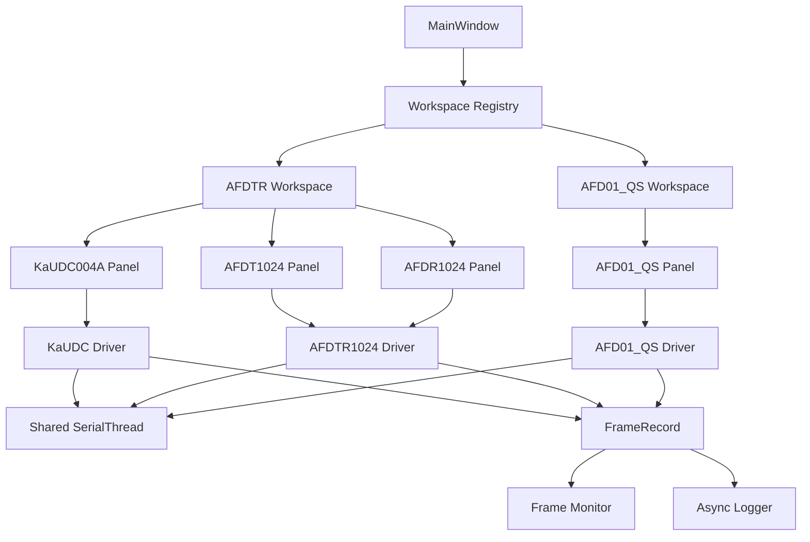
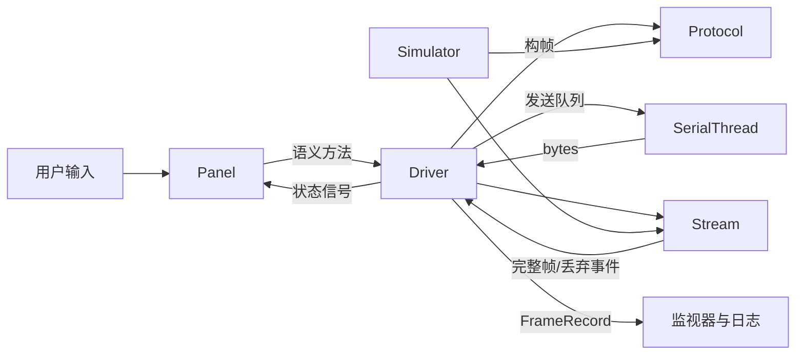

# SoftHertz Tool 架构概览

## 1. 架构目标

SoftHertz Tool 是可扩展的多设备串口调试上位机。架构需要同时满足：

- 不同设备协议和界面可以独立演进；
- 串口、日志、资源和通用控件只维护一份；
- 高频串口数据不阻塞 Qt 主线程；
- 工作区切换和程序退出能够确认释放串口及线程；
- 协议、流式拆帧和模拟器可以在无 GUI 环境测试；
- 静态模块结构可被 PyInstaller 完整收集；
- 新增设备时不修改主窗口的设备特判逻辑。

## 2. 当前工作区与设备



`AFDTR` 是工作区名称。`AFDT1024` 和 `AFDR1024` 是两个真实设备型号，内部共用 `devices/afdtr1024` 的协议、驱动、页面基类和模拟器内核。

## 3. 分层与依赖方向

```text
app -> workspaces -> devices -> shared
```

依赖只能从左向右：

| 层 | 职责 | 禁止事项 |
| --- | --- | --- |
| `app` | 应用初始化、主窗口、产品身份、静态 registry、全局退出 | 不实现设备协议，不直接创建具体设备 Driver |
| `workspaces` | 组合一个或多个 Panel，统一前后台生命周期 | 不构帧、不拆帧、不复制串口实现 |
| `devices` | 设备协议、流解析、Driver、Panel、模型、控件和模拟器 | 不导入 `app` 或 `workspaces` |
| `shared` | 串口、端口扫描、日志、资源、生命周期契约和共享 UI | 不导入任何具体设备 |

集成测试会检查：

- `shared` 不依赖 `devices`、`workspaces`、`app`；
- `devices` 不依赖 `workspaces`、`app`；
- `protocol.py` 和 `stream.py` 不依赖 Qt 或 pyserial。

## 4. 设备纵向切片

每个设备目录围绕完整业务链路组织：

```text
devices/<device>/
├── __init__.py
├── protocol.py      # 帧结构、校验、字段编解码、语义转换
├── stream.py        # 分包、粘包、坏帧和异常字节恢复
├── driver.py        # 串口会话、协议分派、语义信号和命令接口
├── panel.py         # 输入、状态展示和用户交互
├── models.py        # 可选：枚举、dataclass、状态模型
├── widgets.py       # 可选：设备专用控件
└── simulator.py     # 可选：复用正式协议的模拟器
```

职责边界：



- Panel 不持有 pyserial 对象，不直接拼接字节帧；
- Driver 不读取控件值，不直接更新 Qt 控件；
- protocol 只做确定性的字节与语义转换；
- stream 可接收任意大小字节块，并在错误后继续寻找下一帧；
- simulator 复用 protocol/stream，避免形成第二套协议真值。

## 5. 串口线程模型

`shared.transport.SerialThread` 是当前唯一串口传输基础设施：

1. 所属线程打开 pyserial 对象；
2. 线程循环读取串口，并把字节交给具体 Driver；
3. UI 或 Driver 通过有界队列提交待发送帧；
4. 串口线程负责实际写入；
5. 读写均使用有限超时；
6. 停止时取消阻塞 I/O，等待线程退出并返回结果。

关键约束：

- pyserial 对象不能跨线程直接读写或关闭；
- Qt 控件只能在主线程更新；
- UI 线程不得执行阻塞串口调用、长循环或 `sleep`；
- 快速断开/重连时，用连接代际过滤旧 Driver 的延迟信号；
- Driver 未确认退出时，调用方不得销毁对象或继续切换页面。

## 6. 工作区生命周期

所有 Workspace 实现统一契约：

```python
activate() -> None
deactivate() -> bool
shutdown() -> bool
```

- `activate()`：恢复前台页面需要的定时器或刷新；
- `deactivate()`：暂停页面定时器、断开串口并确认线程退出；
- `shutdown()`：幂等地释放全部设备和其他后台资源。

主窗口切换工作区时先停用当前页。停用失败则恢复当前页并取消切换。窗口关闭时依次停用并关闭全部 Workspace，再关闭全局日志线程；任何关键线程未退出都应取消关闭。

## 7. 高频数据与可观测性

所有设备通过 `FrameRecord` 输出统一事件：

- `TX`：已进入发送路径的完整帧；
- `RX`：已接收并解析的完整帧；
- `DROP`：坏长度、坏校验、异常字节或其他丢弃事件。

处理链路分层：

```text
串口原始流 -> Driver/Stream -> FrameRecord
                              ├── UI：100 ms 批量刷新，最多 10000 行
                              └── 日志线程：异步写入，50 MiB 轮转
```

AFD01_QS 的 A0 原始接收可达到约 100 Hz，但业务控件最多按 10 Hz 更新。统计、界面刷新和磁盘写入不得反向阻塞串口接收。

默认日志目录为：

```text
Documents/SoftHertz/SoftHertz_Tool/logs
```

日志轮转只新建文件，不自动删除旧文件。

## 8. Registry 与打包

Workspace 由静态 registry 声明。每个条目包含稳定 key、UI 标题和工厂函数：

- key 用于持久化工作区选择；
- 标题用于 UI；
- 工厂函数创建 Workspace。

静态注册不依赖运行时目录扫描，便于：

- 代码审查时明确支持的工作区；
- 测试 registry key 的唯一性；
- PyInstaller 收集模块；
- 主窗口遍历 Workspace，而不维护逐设备特判。

PyInstaller 从 `packaging/entrypoint.py` 进入正式包，构建脚本位于 `packaging/build_windows.py`。源代码、editable install 和打包产物都通过包内资源定位加载 PNG/ICO。

## 9. 产品状态与持久化

- UI 产品名：`SoftHertz Tool`；
- 配置组织名：`SoftHertz`；
- 配置应用名：`SoftHertz_Tool`；
- 工作区选择保存在 QSettings；
- 配置迁移只复制有效偏好，不删除旧配置；
- 日志和用户导出文件不写入源码目录。

不得使用 QSettings 保存口令、访问令牌或客户敏感数据。

## 10. 扩展边界

当前 `shared.transport` 只提供串口。DEBUG 通用设备、TCP、UDP、广播通信和通用多通道曲线不属于当前能力。

新增串口设备时，优先增加新的设备纵向切片。新增 TCP/UDP 等传输方式时，应先定义：

- 传输接口与线程归属；
- 打开、发送、停止和超时语义；
- 与 Driver 的依赖方式；
- 生命周期与异常恢复；
- 对应共享测试和集成测试。

不能把新的传输实现临时塞入某个 Panel，也不能复制现有串口线程后只改少量调用。
